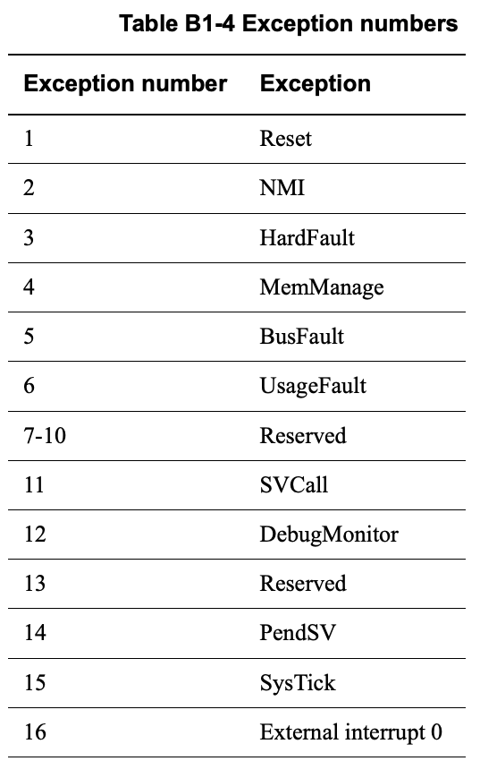
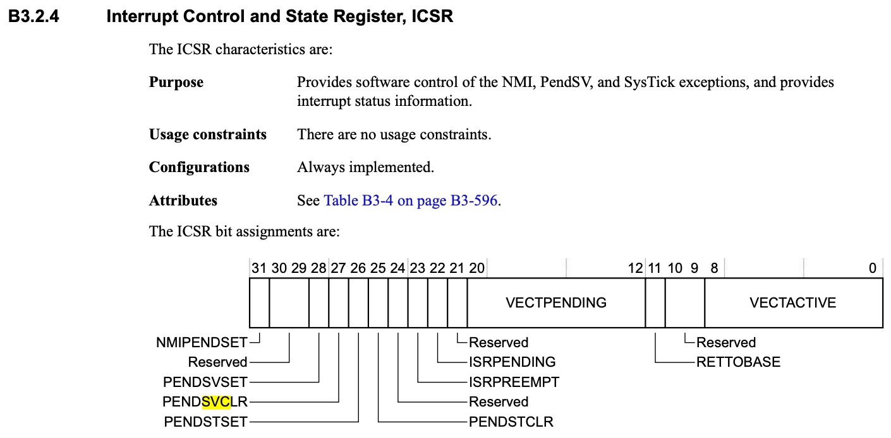
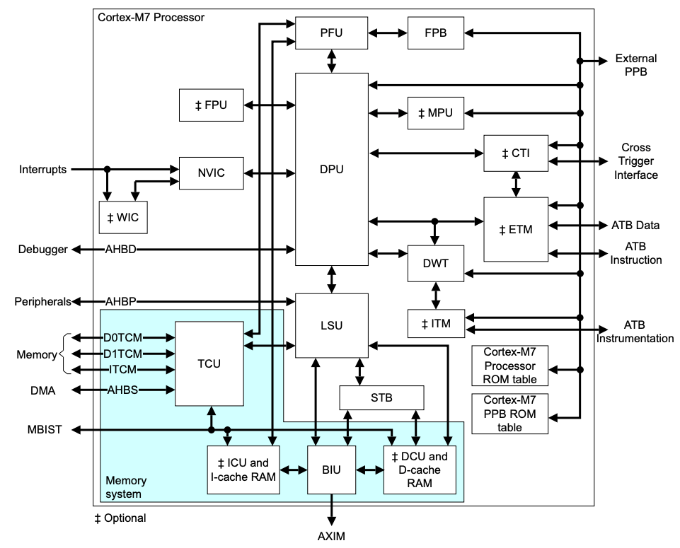
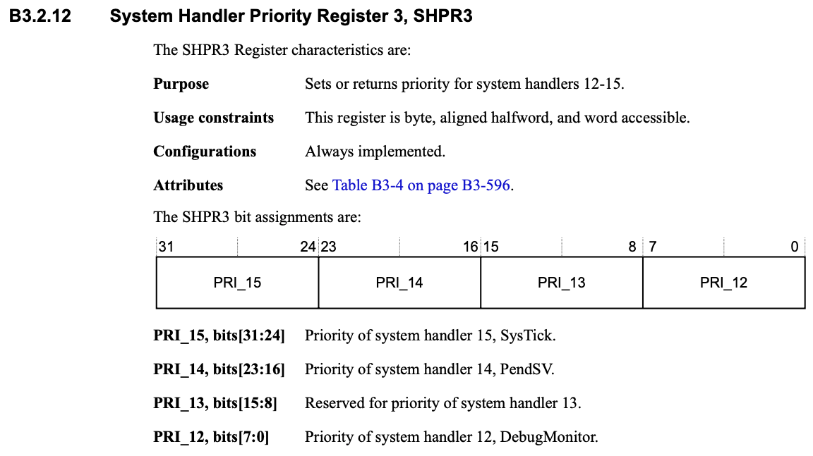
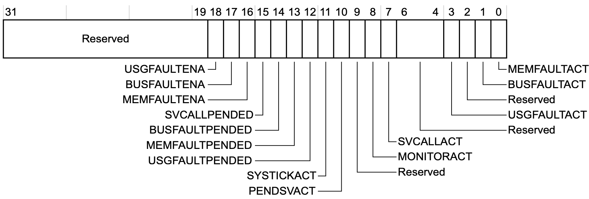
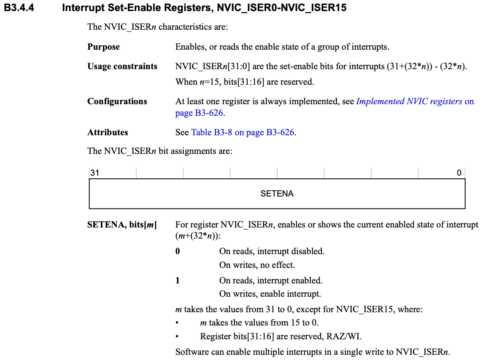
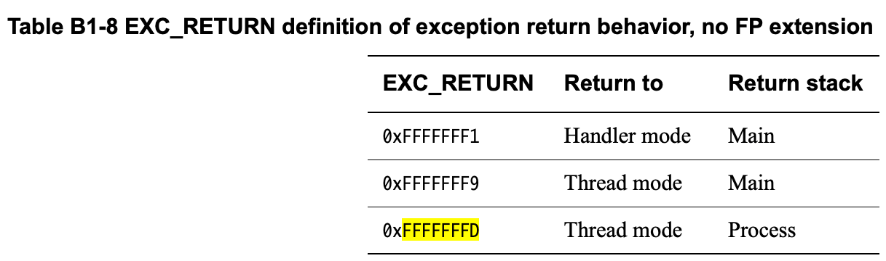

# Cortex M7 exception model

This article is compatible with: M0/M1/M3/M4/M7

## What is exception ?
Anything which disturbs the normal operation of the program by changing the operational mode of the processor

There are 2 types of exceptions:
1. System exceptions
2. Interrupts

### What are system exception
- System exception are generated by the processor itself internally
- Interrupts come from the external world to the processor
- Whenever the processor core meets with an exception it changes the "operational mode" to "handler mode"
- There are in total 15 system exceptions supported by the Cortex M processors and 240 interrupts. 
  Therefore, Cortex Mx processors support 255 exceptions

## Different system exceptions
- There is room for 15 system exceptions
- Execution number 1 is reset exception or system exception
- Only 9 implemented system exceptions. 6 are reserved for future implemenations
- Exception number 16 is Interrupt 1 (IRQ no.1)
- Exception table in Cortex M7

  


### Exceptions
Let's see some exceptions in arm cortex-m7
1. Reset:
   - Invoked on power up or a warmup reset, e.g. reset button.
   - When the reset is asserted, the operation of the processor stops.
   - When the reset is deasserted, execution restarts from the address provided by the reset entry in the vector table.
   - Execution restarts as privileged execution in thread mode
   - The Reset exception is permanently enabled with a fixed priority of -3.
2. NMI, Non Maskable Interrupt:
   - Actually, this is not an exception, this is a signal triggered by peripheral or software.
   - This is permanently enabled and has a fixed priority of -2
3. Hard fault
   - HardFault is the generic fault that exists for all classes of fault that cannot be handled by any of the
     other exception mechanisms.
   - Typically, **HardFault is used for unrecoverable system failures, 
     although this is not required and some uses of HardFault might be recoverable.**
   - HardFault is permanently enabled with a fixed priority of -1.
4. Memory management
5. Bus fault
6. Usage Fault
   - If we keep T-bit to 0, the processor will use arm instruction instead of thumb instruction
   - Therefore, for cortex m processor, this is undefined instruction
7. Supervisor call (SVC)
   - An exception caused explicitly by the SVC instruction. 
   - Application software uses the SVC instruction to make a call to an underlying operating system. 
   - The SVC instruction enables the application to issue a Supervisor Call that requires privileged access to the
     system and executes in program order with respect to the application. 
   - This Supervisor Call handles the exception caused by the SVC instruction. 
   - SVCall is permanently enabled and has a configurable priority.
   - **SVC instruction is used to implement kernel mode**
8. System level interrupt
   - The Armv7-M profile supports two system-level interrupts, and up to 496 external interrupts. Each
   interrupt has a configurable priority. The system-level interrupts are:
     - PendSV used for software-generated system calls. An application uses a Supervisor Call, if it
       requires servicing by the underlying operating system. The Supervisor Call associated
       with PendSV executes when the processor takes the PendSV interrupt.
       - Note
         - For a Supervisor Call that executes synchronously with program execution, software
           must use the SVC instruction. This generates an SVCall exception.
         - PendSV is permanently enabled, and is controlled using the `ICSR.PENDSVSET` and
          `ICSR.PENDSVCLR` bits.
         - **This is used to do the context switching**
     - SysTick generated by the SysTick timer that is an integral component of an Armv7-M processor.
         SysTick is permanently enabled, and is controlled using the `ICSR.PENDSTSET` and
         `ICSR.PENDSTCLR` bits.
         - Note
           - Software can suppress hardware generation of the SysTick event, but
             ICSR.PENDSTSET and ICSR.PENDSTCLR are always available to software.



### ARM cortex M7 processor peripherals



This is arm cortex m7 processor, in this diagram, there are several peripherals in the processor

### System Control Block (SCB)
- The system control block (SCB) provides system implementation information and system control.
  This includes configuration, control and reporting of the system exceptions
- Explore registers from ARM cortex M7 user guide

These registers are used to modify the priority of the handlers
```txt
0xE000ED18 SHPR1 RW 0x00000000 System Handler Priority Register 1
0xE000ED1C SHPR2 RW 0x00000000 System Handler Priority Register 2
0xE000ED20 SHPR3 RW 0x00000000 System Handler Priority Register 3
```



and let's see the system handler control and state register, `SHCSR`
- Exception processing automatically updates the SHCSR fields. However, software can
  write to the register to add or remove the pending or active state of an exception.
- Please use read-modify-write sequence to avoid unintended effects on the state of the exception handlers
  

#### Summarize
- You can enable fault handlers
- Get pending status of the fault exceptions
- Trap processor for divide by zero and unaligned data access attempts
- Control sleep and sleep wakeup settings
- Configure the priority of system exceptions
- Systick timer control and status

## Nested vector interrupt controller (NVIC)
1. NVIC is one of the peripheral of the cortex M processor core
2. It is used to configure the 240 interrupts
3. using NVIC registers you can enable/disable/pend various interrupts and read the status of the 
   active and pending interrupts
4. You can configure the priority and priority grouping of various interrupts
5. Its is called as "Nested" because, it supports preempting a lower priority interrupt handler when
   higher priority interrupt arrives

### How to enable/disable/pend various interrupts using NVIC register
1. Cortex M processor supports 240 interrupt, in M7, it supports at most 495 interrupts
2. These interrupts are managed and configured using NVIC
3. What are those 240 interrupts ?
    - You need to check the microcontroller, the 240 interrupts connect on the MCU
    - This is highly vendor specific and it is triggered by various on chip peripherals
      of the MCU like SPI, GPIOs, CAN, timers etc.
   ```txt
        ARM                                         |   Vendor (STM, TI etc.)  
        CPU ---> NVIC ---> External interrupt no.1 -+-> GPIO
                   +-----> External interrupt no.2 -+-> Wdog    
                   +-----> External interrupt no.3 -+-> timer
                   +-----> External interrupt no.4
                   +-----> External interrupt no.5
                   +-----> External interrupt no.6
                   +-----> External interrupt no.7
                   ...
   ```
#### NVIC_ISER, Interrupt Set-Enable Registers


We need to enable the nvic interrupt by setting the ISER-series register
set one as enable, set zero is not working

same as `Interrupt Clear-Enable Registers, NVIC_ICER0-NVIC_ICER` for disable interrupt
, `Interrupt Set-Pending Registers, NVIC_ISPR0-NVIC_ISPR15` for pending interrupt
, `Interrupt Clear-Pending Registers, NVIC_ICPR0-NVIC_ICPR15` for clear pending interrupt

Additionally, we can see the interrupt active bit register to know the interrupt status
that is `Interrupt Active Bit Registers, NVIC_IABR0-NVIC_IABR15`

## Interrupt priority and configuration
- What is priority ?
  - Priority means urgency, how urgent the interrupt is?
- What is priority value ?
  - For arm cortex Mx processor, lesser the priority value, higher the priority
- Different programmable priority levels
  - In STM32F7, there are 16 programmable priority levels
- Explore priority registers for interrupts (IRQs)
  - In NVIC registers
- Explore priority registers for system exceptions
  - In system handler priority register
- Preempt priority and sub priority
  - Preempt priority: when the processor is running interrupt handler, and another interrupt
    appears, then the preempt priority values will be compared, and interrupt with higher
    preempt priority will be allowed to run
  - Sub priority: When two interrupts with the same preempt priority values occur at the same
    time. In this case, the exception with higher sub-priority will be handled first
  - Thus, there are priority grouping, we can change the priority group by modifying `Application Interrupt and Reset
    Control Register, AIRCR` register
    
| Priority Group | Preempt priority field | sub priority field |
|----------------|------------------------|--------------------|
| 0(Default)     | Bit[7:1]               | Bit[0]             |
| 1              | Bit[7:2]               | Bit[1:0]           |
| 2              | Bit[7:3]               | Bit[2:0]           |
| 3              | Bit[7:4]               | Bit[3:0]           |
| 4              | Bit[7:5]               | Bit[4:0]           |
| 5              | Bit[7:6]               | Bit[5:0]           |
| 6              | Bit[7:7]               | Bit[6:0]           |
| 7              | Nan                    | Bit[7:0]           |

## Exception entry and exit sequences
### Exception entry sequence
1. the pending bit is set
2. stacking and vector fetch. Stacking is pushing the contents of the register to the stack
3. Entry into the handler and active bit set
4. Clears the pending status (processor does it automatically)
5. Now the processor mode changed to handler mode
6. Now handler code is executing
7. The MSP will be used for any stack operations inside the handler
### Exception exit sequence
1. In cortex M3/M4, processors the exception return mechanism is triggered using a special return address called EXC_RETURN

   
2. EXC_RETURN is generated during exception entry and is stored in the `LR`
3. When EXC_RETURN is written to PC, it triggered the exception return

Let's see a diagram, from user mode to kernel mode


#### When it is generated?
During an exception handler entry, the value of the return address (PC) is not stored
in the LR as it is done during calling of a normal C function. Instead, the exception
mechanism stores the special value called EXC_RETURN in LR

#### Decode the EXC_RETURN
- Bits[31:28]: `0xF`. This value identifies the value in a PC load as an EXC_RETURN value.
- Bits[27:5]: `0xFFFFFF`. Reserved.
- Bit[4]: always 1 when floating point unit is not available
- Bit[3]: Return mode, set 1 as return to thread mode, 0 as handler.
- Bit[2]: Return stack, set 1 as return to PSP, 0 as MSP.
- Bit[1]: 0. Reserved.
- Bit[0]: 1. Reserved.

## Fault handling
- What is a fault ?
  - The fault is an exception generated by the processor (system exception) to indicate
    an error
- Why fault happens?
  - Faults happen because of programmers handling processor by violating the design rules or 
    may be due to interfaces with which the processor deals
  - Whenever a fault happens, internal processor registers will be updated to record the type of fault, 
    the address of instruction at which the fault happened, and if an associated exception is enabled, the exception
    handler will be called by the processor
  - In the exception handler programmers may implement the code to report, resolve, or recover from the fault
  - For example, if your code tries to divide a number by zero, then divide by 0 fault will be raised from the hardware,
    which will invoke usage fault exception handler. In the exception handler, you may make certain decisions to get rid 
    of the problem, like closing the task etc.
  - Most of the time, fault happens by programmer's code not adhering to processor programming guidelines.

### Different types of fault exceptions in Cortex Mx processor
- Hard fault exception, enabled by default, non-configurable priority
  - can be disabled by code using `FAULTMASK` register
- These are disabled by default, configurable priority
  - Usage fault exception
  - Mem manage fault exception
  - Bus fault exception
- reason of faults
  - divide by zero
  - undefined instruction
  - attempt to execute code from the memory region which is marked as execute never (XN).
  - MPU guarded memory region access violation by the code
  - Unaligned data access
  - Returning to thread mode keeping active interrupt alive
  - Bus error
  - Executing SVC instruction inside SVC handler or calling a function in SVC handler which eventually execute hidden SVC instruction
  - Debug monitor settings and related exceptions

### Hard fault exception
A **HardFault** is an exception that occurs because of an error during exception processing, 
or because an exception cannot managed by any other exception mechanism. It has 3rd highest fixed priority after reset and
NMI meaning it has higher priority than any exception with configurable priority

Causes:
1. Escalation of configurable fault exceptions
2. Bus error returned during a vector fetch
3. Execution of break point instruction when both halt mode and debug monitor is disabled
4. Executing SVC instruction inside SVC handler

```txt
Thread mode, Executing of SVC instruction
Handler mode, Executing of SVC instruction
Hanlder mode, hardfault handler
```

HardFault status register
- DEBUGEVT, bit[31] Indicates when a Debug event has occurred:
  - 0 No Debug event has occurred.
  - 1 Debug event has occurred. The Debug Fault Status Register has been updated.
- FORCED, bit[30] Indicates that a fault with configurable priority has been escalated to a HardFault exception,
  because it could not be made active, because of priority or because it was disabled:
  - 0 No priority escalation has occurred.
  - 1 Processor has escalated a configurable-priority exception to HardFault.
- VECTTBL, bit[1] Indicates when a fault has occurred because of a vector table read error on exception
  processing:
  - 0 No vector table read fault has occurred.
  - 1 Vector table read fault has occurred.

## Exception for system level services
- ARM cortex mx processor supports 2 important system-level service exceptions. one is SVC (supervisor call), the other
  is PendSV (Pendable Service)
- Supervisory calls are typically used to request privileged operations or access to system resources from an OS
- SVC exception is mainly used in an OS environment. E.g., a less privileged user task can trigger SVC exception to get
  system-level services (like accessing device drivers, peripherals) from the kernel of the OS
- PendSV is mainly used in an OS environment to carry out context switching between 2 or more tasks when no other exceptions
  are active in the system

### SVC instruction
- SVC is a thumb ISA instruction which causes SVC exception
- In an RTOS scenario, user tasks can execute SVC instruction with an associated argument to make supervisory calls 
  to seek privileged resources from the kernel code
- Unprivileged user tasks use the SVC instruction to change the processor mode to privileged mode to access privileged resources like peripherals
- SVC instruction is always used along with a number, which can be used to identify the request type by the kernel code
- The SVC handler executes right after the SVC instruction

Sameple code:
```c
/* In user space */
__asm__ volatile("SVC #1");

/* this will trigger the SVC handler */

/*-------------------------------------------------------------------*/
/* In handler mode */
void SVC_Handler(int svc_number) {
    switch (svc_number) {
        case 1:
            ...
case 2:
...
}
}

/*-------------------------------------------------------------------*/
/* the system code can require the privileged resource 
 * may be it can access the memory region protected in MPU
 * */
```

When the processor get into handler mode, it will put the register to the stack

```txt
Last stack item
---------------
xPSR
Return address (PC)
LR
R12
R3
R2
R1
R0 <-------------------- MSP
```

### Methods to trigger SVC exception

There are two ways

1. Direct execution of SVC instruction with an immediate value, more efficiently
2. Setting the exception pending bit in `System Handler control and state register`

### How to extract the SVC number

- The SVC instruction has a number embedded within it, often referred to as the SVC number
- In the SVC handler, you should fetch the opcode of the SVC instruction and then extract the SVC number
- To fetch the opcode of SVC instruction from program memory, we should have the value of PC (return address) where the
  user code
  had interrupted while triggering the SVC exception
- The value of the PC (return address) where the user code had interrupted is stored in the stack as a part of
  exception entry sequence by the processor
    - Note: Read the PC value, that is, the address of the current instruction + 4

### PendSV exception

- It is an exception type 14 and has a programmable priority level
- This exception is triggered by setting its pending status by writing to the "Interrupt control and state register" of
  processor
- Triggering a pendSV system exception is a way of invoking the preemptive kernel to carry out the context switch in an
  OS environment
- In an OS environment, PendSV handler is set to the lowest priority level, and the pendSV handler carries out the
  context switch operation

#### Typical use of pendSV

- Typically, this exception is triggered inside a higher priority exception handler, and it gets executed when the
  higher
  priority handler finishes
- Using this characteristic, we can schedule the pendSV exception handler to be executed after all the other interrupt
  processing tasks are done
- This is very useful for a context switching operation, which is a crucial operation in various OS design
- Using PendSV in context switching will be more efficient in an interrupt noisy environment
- In an interrupt noisy environment, and we need to delay the context switching until all IRQ are executed

#### PendSV other use cases

- Offloading interrupt processing
- If a higher priority handler is doing time-consuming work, then the other lower priority interrupts will suffer, and
  systems reponsive ness may reduce.
  This can be solved using a combination of ISR and pendSV handler
- Interrupts may be serviced in 2 halves
    - The first half is the time critical part that needs to be executed as a part of ISR
    - The second half is called bottom half, is basically delayed execution where reset of the time-consuming work will
      be done
    - Therefore, PendSV can be used in these cases, to handle the second half execution by triggering it in the first
      half
