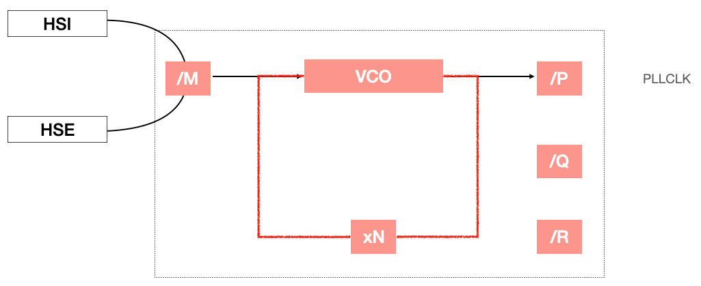

# timer

## System clock (SYSCLK)
- Three different clock sources can be used to drive the system clock
  - HSI oscillator clock
  - HSE oscillator clock
  - Two main PLL clocks
- The devices have two following secondary clock sources
  - 32 kHz low-speed internal RC (LSI RC), which drives the independent watchdog and, optionally, 
    the RTC used for auto wakeup from the stop/standby mode
  - 32.768 kHz low_speed external crystal which optionally drives the RTC clock (RTCCLK)

## In NUCLOE-F746 board
- HSI -> 16 MHz
- HSE -> Check the schmetic, in NUCLEO-F746ZF
- PLL
  - High Speed clock, up to 216 MHz
  - used for USB, RNG etc. peripheral, used to generate 48 MHz
- LSE clock -> 32.768 kHz
- LSI clock -> 32 kHz

## Default clock state
- After reset of the MCU
  - HSI is on
  - HSE is off
  - PLL is off
  - LSE is off
  - LSI is off
- So, systick sourced by HSI
  - i.e. SYSCLK = 16 MHz
- Each clock source can be switched on or off independently when it is noe used, to optimize power consumption

### HSI
- The HSI is used as system clock source after startup from reset, wake-up from stop and standby mode, or in case of 
  failure of the HSE used directly or indirectly as system clock
  - default and backup clock
- The HSI RC oscillator has the advantage of providing a clock source at low cost (no external components)
- It also has a faster startup time than the HSE crystal oscillator
- However, even with calibration the frequency is less accurate than an external crystal oscillator or ceramic resonator
- The HSI signal can also be used as backup source if the HSE crystal oscillator fairs

### Method to configure the `SYSCLK` Source
- First enable the required clock and wait until the clock is ready. If your application needs PLL, 
  then configure the PLL and enable it
- Initializes the CPU, AHB and APB busses clock prescalers according to your application requirements. Do not cross maximum limits
- Configure the flash latency propertly by referring to MCU RM
- Select newly enable clock as SYSCLK

### Exercise
- Using HSE configure the SYSCLK as 8 MHz
- AHB clock as 4 MHz (HCLK)
- APB1 clock as 2 MHz (PCLK1)
- APB2 clock as 2 MHz (PCLK2)

```c
HAL_RCC_OscConfig
HAL_RCC_ClockConfig
```

## HSI Calibration
- The operating temperature has an impact on the accuracy of the RC oscillators. At 25 C, the HSI oscillators have
  an accuracy of +- 1% typically, but the temperature range of -40 C to 105 C, the accuracy decreases
- To compensate for the influence of temperature in the application, the output frequency of the HSI oscillator can be
  further trimmed by the user runtime calibration routine to improve the HSI frequency accuracy. This may prove crucial
  communication peripherals
- HSI RC oscillators are factory calibrated by ST to have a 1% accuracy at TA=25 C. After reset, the factory calibration 
  value is automatically loaded in the internal calibration bits
  - we can modify the trim by writing the RCC_CR `HSITRIM` bits
  - The frequency of the RC oscillators can be fine-tuned to achieve better accuracy with wider temperature and supply voltage ranges.
    The trimming bits are used for this purpose
  - The calibration value is loaded in `HSICAL[7:0]` bit after reset. Five trimming bits are used for fine-tune. The default
    trimming value is 16
- Effect of `HSITRIM`, default is 16Mhz
  - The default trimming value is 16
  - An increase in this trimming value causes an increase in HSI frequency (write 17 - 31)
  - Decrease in this trimming value causes decrease in HSI frequency (write 0 - 15)
  - The HSI oscillator is fune-tuned in steps  of 0.5% (around 80kHz)

## PLL engine
- The PLL engine of the MCU is used to generate different high frequency output clocks by taking input clock sources 
  such as HSE or HSI
- By using PLL, you can drive SYSCLK up to 216 MHz in STM32F746



Notice that:
- 1 MHz < f_vco_input < 2 MHz
- 100 MHz < f_vco_output < 432 MHz

Formula in PLL:
- f_vco_output = (HSE or HSI) / PLL_M * PLL_N
- f_pll_gco = f_vco_output / PLL_P

## Timer
- What exactly is a timer?
  - It is one of the peripheral of the microcontroller
- What are the uses of a timer
  - Time base generation
  - Measuring/counting input signal frequency (measuring time periods of waveform)
  - Producing different waveforms
  - Generating pulse width modulation (PWM) signals
  - Triggering external devices
- What does a timer do ?
  - A timer at the basic level just counts from 0 to some pre-programmed value (up counting) 
    or from some pre-programmed value 0 (down counting)
  - When the timer is count the pre-programmed value, an update event will happen
- Type of STM32 timers
  - Basic timers (available in ALL STM32 MCUs)
  - General purpose timer (available in All STM32 MCUs)
  - Advanced timer (not available in all STM32 MCUs)
- In the application note
  - Advanced timer: timer1, timer8
  - General purpose timer: 
    - 32 bit: timer2, timer 5
    - 16 bit: timer3, timer 4
  - Basic timer: timer 6, timer 7
  - one channel timer: timer 10, timer 11, timer 13, timer 14
  - two channel timer: timer 9, timer 12
- Summary
  - The number of timer peripherals and their repective features differ from one STM32 microcontroller family to another,
    but they all share some common features and operating modes
  - For example, the STM32F100 microcontrollers embed a timer peripheral named TIM17, but the total number of timer peripherals
    embedded by these microcontroller is less than 17
  - In general, accross the STM32 microcontrollers families, the timer peripherals that have the same name also have the
    same features set, but there are a few exceptions
  - The level of features integration for a given timer peripheral is decided based on the application field that it targets
### Basic timer
- These timers have basic counting engine and majory used for timer base generation
- These timers do not have input/output channels associated with them
#### Exercise
Use the basic timer to generate interrupt for every 100 ms. Toggle the GPIO or LED inside the timer IRQ handler and 
verify using logic analyzer