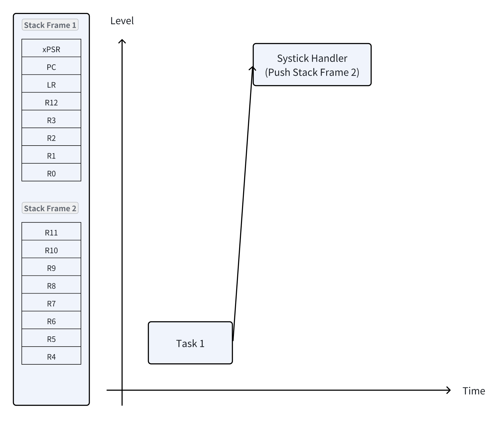

# Contex Switch

- architecture: arm cortex m7
- source code: [test_main.c](../test_code/context_switch.c)

## Introduction

- In context switch target, i wil implement a scheduler which schedule multiple user tasks in a round-robin fashion
  by carrying out the context switch operation
- Round-robin scheduling method is, time slices are assigned to each task equal portions and in circular order
- First will use systick handler to carry out the context switch operation between multiple tasks
- Later will we change the code using pendSV handler

## What is a task?

- A task is nothing but a piece of code, or you can all it a `C` function, which does a specific job when it is allowed
  to run on the CPU
- A task has its own stack to reate its local variables when it runs on the CPU. Also when scheduler decides to remove a
  task from CPU,
  scheduler first saves the context of the task in task's private stack
- So, in summary, a piece of code or a function is called a task when it is schedulable and never lose its 'state'
  unless it is deleted permanently

## In this test code...

- We wil create 4 user tasks (never returning C functions)
  ```c
  void task1_handler(void);
  void task2_handler(void);
  void task3_handler(void);
  void task4_handler(void);
  ```
- Configure the systick timer to produce exception for every 1 ms
    - systick count value calculation
        - processor timer count clock = 16 Mhz
        - systick timer count clock = 16 Mha
        - 1 ms is 1 kHz frequency domain
        - Reload value = 16000

## Stack pointer selection

There are two kinds of stack pointer (R13),

- PSP, process stack pointer, used in thread mode
- MSP, main stack pointer, used in scheduler

In our case, we will use `systick` handler to be scheduler

There are 320 kB SRAM in STM32f746, and maybe i will use only 128 kB
and there is the memory layout:

- private stack scheduler:  1 kB
- private stack for task 1: 1 kB
- private stack for task 2: 1 kB
- private stack for task 3: 1 kB
- private stack for task 4: 1 kB

## Scheduling policy selection

- we will be using round-robin preemptive scheduling
- no task priority
- we will use systick timer to generate exception for every 1ms to run the scheduler code

### What is scheduling ?

- Scheduling is an algorithm which takes the decision of preempting a running task from the CPU
  and takes the decision about which task should run on the CPU next
- The decision could be based on many factor such as system load, the priority of tasks
  shared resource access, or a simple round-robin method

### What is context-switching ?

- Context switching is the procedure of switching out of the currently running task from the CPU
  after saving the task's execution context or state and switching in the next task's to tun on the
  CPU by retrieving the past execution context or state of the task

### Summary: state of a task

- General purpose register: `R0` ~ `R12`
- Stack pointer: `PSP` and `MSP`, (`R13`)
- Link register: `LR` (`R14`)
- Program counter: `PC` (`R15`)
- Program status register: `PSR`
    - Application Program Status: `APSR`
    - Interrupt Program Status: `IPSR`
    - Execution Program Status: `EPSR`
    - Note: software use `MRS` or `MSR` instructions to access the complete `PSR`

## Case of T1 switching out and T2 switching in

1. Running `T1`
2. Save the context of T1 of T1's private stack --> `push` (Context saving)
3. Save the `PSP` value of T1
4. Get the current `PSP` value of T2
5. Retrieve the context of T2 from T2's private stack --> `pop` (Context retrieve)
6. Run T2

### Detail Step


Here, we need to save the value of `PSP`. Because it is required later when processor needs to resume the execution of
T1
by retrieving its saved state.

### Task's stack area init and storing of dummy SF

- Each task can consume a maximum of 1kB of memory as a private stack
- This stack is used to hold tasks local variables and context (SF1 + SF2)
- When a task is getting scheduled for the very first time, it doesn't have any context. So, the programmer should store
  dummy SF1 and SF2 in Task's stack area as a part of task initialization sequence before launching the scheduler

### How to set the register

- Process Stack Register (`xPSR`)
    - `EPSR`: bit[24] is t bit, we only need to care of this bit, thumb state
- Return address (`PC`)
    - We need to store the address of handler, if we need to switch to t2, we need to store the task 2 address, and make
      sure the lsb is 1
- Link Register (`LR`), exception return register

Exception return register

| EXC_RETURN | Return to    | Return stack  |
|------------|--------------|---------------|
| 0xFFFFFFF1 | Handler Mode | Main Stack    |
| 0xFFFFFFF9 | Thread Mode  | Main Stack    |
| 0xFFFFFFFD | Thread Mode  | Process Stack |

We will use  `0xFFFFFFFD` this one to be the execution return address

### Inline assembly format

Example: inline assembly add a, b

```c
__asm__ (
"add %1, %0;"  // Add the value in operand 1 to operand 0
: "=r" (result)  // Output operand (result), using any general register
: "r" (a), "0" (b)  // Input operands (a, b), b is also an earlyclobber operand
);
```

## Blocking state

- When a task has got nothing to do, it should simply call a delay function which should put the task into blocked state
  from
  running state until the specified delay is elapsed
- We should now maintain 2 states for a task. Running and blocked
- The scheduler should schedule only those tasks which are in running state
- The scheduler also should unblock the blocked tasks if their blocking period is over and put them back to running
  state
- Now, we can create a structure, that is task control block, `struct tcb`

## How to block a task ?

### Block task for a given number of ticks

- Let's introduce a function called `task_delay` which puts the calling task to the blocked state for a given number of
  ticks
- E.g., `task_delay(1000)`; if a task calls this function then `task_delay` function puts the task into blocked state
  and
  allows the next task to run on the CPU
- Here, the number 1000 denotes a block period in terms of ticks, the task who calls this function is going to block for
  1000
  ticks (systick exceptions), i.e., for 1000 ms since each tick happens for every 1 ms
- The scheduler should check elapsed block period of each blocked task and put them back to running state if the block
  period is over

### idle task

- What if all the tasks are blocked ? who is going to run on the CPU ?
    - We will use the idle task to run on the CPU if all the tasks are blocked.
    - The idle task is like user tasks but only runs when all user tasks are blocked, and you can put the CPU to sleep

### Global tick count

- TODO: timer interrupt, watchdog timer interrupt
- How does the scheduler decide when to put the blocked state tasks back to the running state ?
- It has to compare the task's delay tick count with a global tick count
- So, the scheduler should maintain a global tick count and update it for every systick exception

## Reference

- [Extended Asm - Assembler Instructions with C Expression Operands](https://gcc.gnu.org/onlinedocs/gcc/Extended-Asm.html#Input-Operands)
- [Arm m7 architecture reference manual](https://developer.arm.com/documentation/ddi0403/latest/)